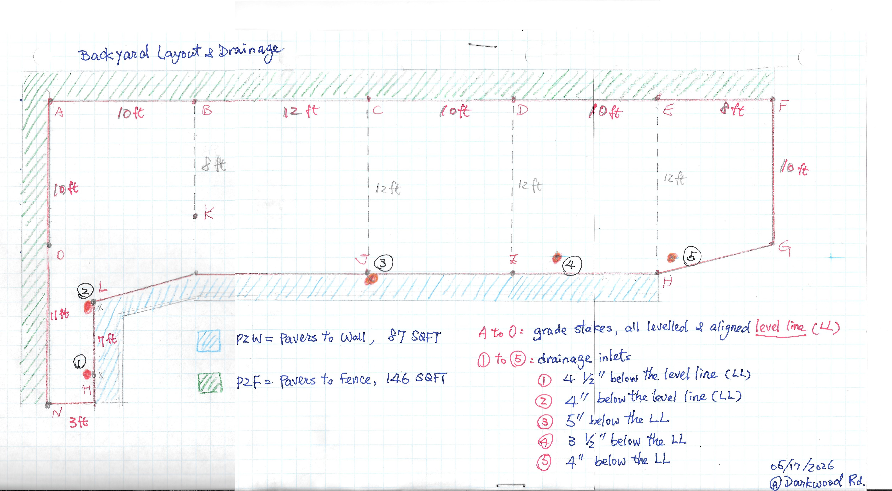

# Drain BLL Plan

## Project Context

This plan is based on the backyard master layout with stakes **A through O** and drainage points **1 through 5**.

The obsolete residual **X marks** on the drawing are ignored. Only the red stake labels and blue drainage labels are used.



## Definitions

- **LL** = Level Line marked on all stakes
- **BLL** = Base Layer Level / subgrade elevation
- **PTE** = Paver Top Elevation / finished paver surface
- **TPE** = Top Paver Elevation near drain areas
- All measurements are expressed as inches **below LL**


## Build-Up Used

| Layer | Thickness |
|---|---:|
| Paver base panel | 2" |
| Porcelain paver tile | 0.75" |
| **Total above BLL** | **2.75"** |

Formula:

```text
PTE = BLL - 2.75"
```

Meaning: if BLL is 6.75" below LL, the finished paver top is 4" below LL.

## Design Rules

1. North-south slope must follow approximately **1/4" drop per 1 ft**.
2. Critical house-border stakes **J, I, and H** must have finished paver surface no higher than **4" below LL**.
3. Stake pairs checked for north-south slope:
   - A → O
   - C → J
   - D → I
   - E → H
4. Field measurements are practical construction values, but this table keeps quarter-inch values where needed to preserve slope accuracy.

## BLL and PTE by Stake

| Stake | BLL | PTE |
|---|---:|---:|
| A | 3.75" below LL | 1" below LL |
| B | 3.75" below LL | 1" below LL |
| C | 3.75" below LL | 1" below LL |
| D | 3.75" below LL | 1" below LL |
| E | 3.75" below LL | 1" below LL |
| F | 3.75" below LL | 1" below LL |
| G | 6.25" below LL | 3.5" below LL |
| H | 6.75" below LL | 4" below LL |
| I | 6.75" below LL | 4" below LL |
| J | 6.75" below LL | 4" below LL |
| K | 5.75" below LL | 3" below LL |
| L | 6.75" below LL | 4" below LL |
| M | 7.25" below LL | 4.5" below LL |
| N | 6.75" below LL | 4" below LL |
| O | 6.25" below LL | 3.5" below LL |

## Required North-South Slope Checks

| Pair | Distance | Required Drop | PTE Drop | Status |
|---|---:|---:|---:|---|
| A → O | 10 ft | 2.5" | 1" → 3.5" = 2.5" | OK |
| C → J | 12 ft | 3" | 1" → 4" = 3" | OK |
| D → I | 12 ft | 3" | 1" → 4" = 3" | OK |
| E → H | 12 ft | 3" | 1" → 4" = 3" | OK |

## Approximate TPE Near Drains

| Drain | Nearby Stake / Zone | Approximate TPE |
|---|---|---:|
| Drain 1 | M / N | 4"–4.5" below LL |
| Drain 2 | L / O | 3.5"–4" below LL |
| Drain 3 | J | 4" below LL |
| Drain 4 | I | 4" below LL |
| Drain 5 | H | 4" below LL |

## Notes

- Drains should be set slightly lower than surrounding finished paver surface so water enters the drain instead of ponding.
- Drain 4 may need special attention because the original drawing marked it at approximately **3.5" below LL**, while the surrounding paver target near I is **4" below LL**.
- Final field installation should verify slope using a laser level or string level before installing the paver base panels.
