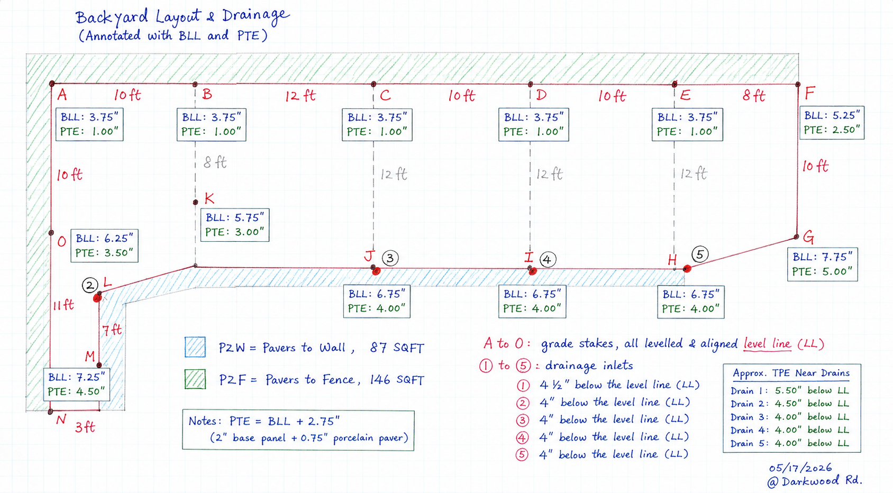
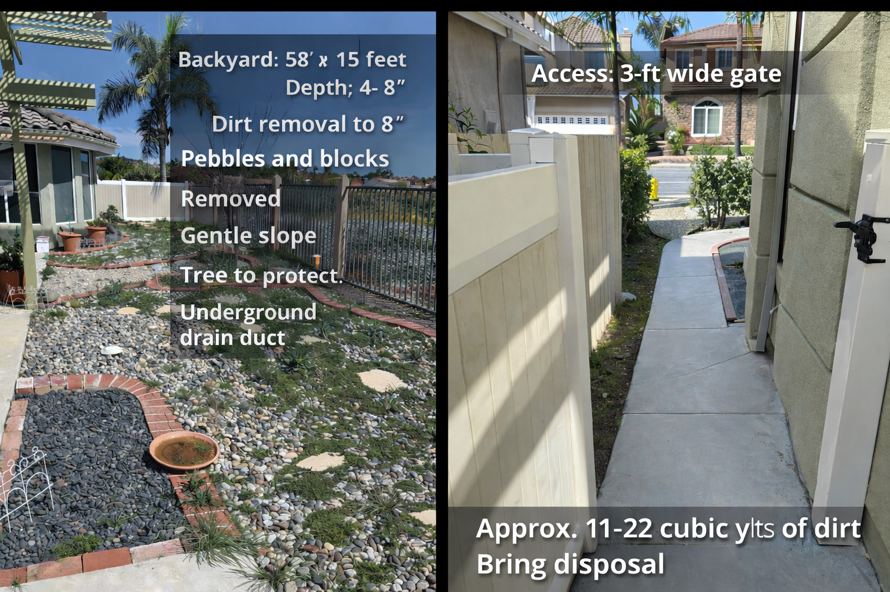
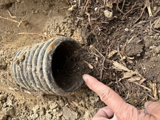
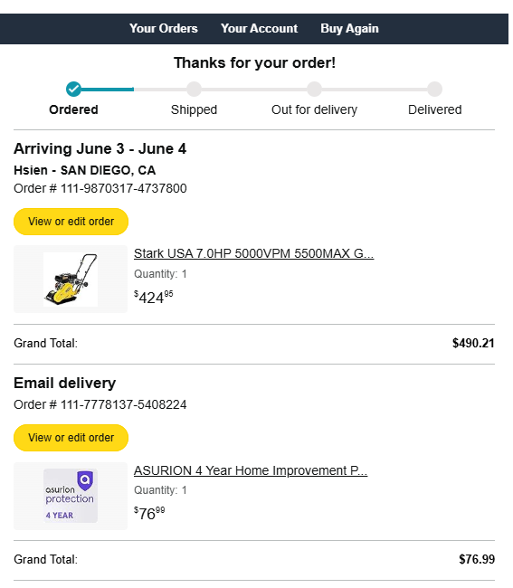
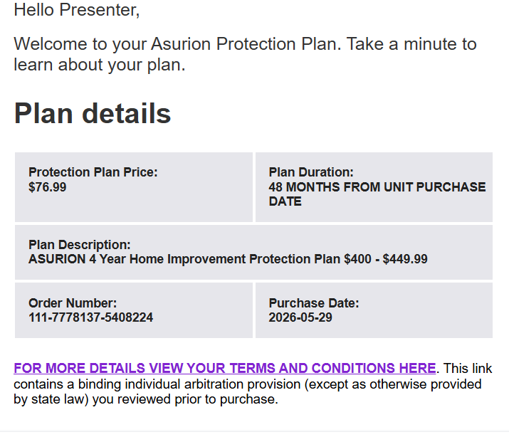

# Backyard Paver Installation Plan (2026)

## Layout Zones

| Zone                            |      Area |
| ------------------------------- | --------: |
| Zone 1 (A-B-C-J-L-M-N-O-A)      | 254 sq ft |
| Zone 2 (C-D-E-F-G-H-I-J-C)      | 328 sq ft |
| Complete Zone (Zone 1 + Zone 2) | 582 sq ft |

---

## Installation System

* Compacted Subgrade
* Geotextile Fabric
* Paver Base Panel SKU #1000029015
* Bluestone Porcelain Paver SKU #1005887752
* 1/8" Tile Spacer
* Polymeric Sand

---


### Mini Excavator (rental) + lowBoy haul 



### fix drain--via drain snake


### Subgrade 50% Completed


## Purchase Plan – Zone 2 (Pilot)

Area: 328 sq ft

| Item                      | SKU        | Qty | Unit Price |      Cost |
| ------------------------- | ---------- | --: | ---------: | --------: |
| Paver Base Panel          | 1000029015 |  74 |     $10.77 |   $796.98 |
| Bluestone Porcelain Paver | 1005887752 |  85 |     $17.97 | $1,527.45 |
| Total                     |            |     |            | $2,324.43 |

### Miscellaneous

| Item                        | Qty |
| --------------------------- | --: |
| 1/8" Tile Spacer (500-Pack) |   1 |

---

## Purchase Plan – Complete Zone (Zone 1 + Zone 2)

Area: 582 sq ft
| Item                                                     | SKU        | Qty | Unit Price |      Cost |
| -------------------------------------------------------- | ---------- | --: | ---------: | --------: |
| Landscape Fabric 3 ft x 300ft (Amazon)                          | —          |   1 |     $59.99 |    $59.99 |
| Washed Masonry Sand, 1000 lb (9 cu ft)                   | 478198     |   4 |     $34.58 |   $138.32 |
| Alliance Gator G2 Maxx Polymeric Sand, 50 lb             | Amazon     |   2 |     $69.48 |   $138.96 |
| Paver Base Panel                                         | 1000029015 | 146 |     $10.77 | $1,572.42 |
| Bluestone Porcelain Paver                                | 1005887752 | 170 |     $17.97 | $3,054.90 |
| House-Side Brick                                         | —          |  70 |      $0.65 |    $45.50 |
| Sierra Blend RW Block (Fence-Side Edging, 3 Courses)     | 343791     | 195 |      $1.97 |   $384.15 |
| Sierra Blend RW Block (Tree Ring, 4 ft Dia x 12 in Tall) | 343791     |  70 |      $1.97 |   $137.90 |
| Total                                                    |            |     |            | $5,532.14 |


### Fence-Side Blocks: O-A-B-C-D-E
```
-Approximate length: 52 feet
-3 stacked courses (wall height: 9 inches)
```
### Miscellaneous

Base Gravel 3/8 SKU #478198

| Item            | SKU    | Qty | Unit Price |    Cost |
| --------------- | ------ | --: | ---------: | ------: |
| Option -1 inch  | 478198 |   6 |     $31.33 | $187.98 |
| Option -2 inch  | 478198 |  11 |     $31.33 | $344.63 |

(each bag: 9 cuft, or 1/3 cuyd, 1000lb)

| Item                        | Qty |
| --------------------------- | --: |
| 1/8" Tile Spacer (500-Pack) |   2 |
| 1.5" x 100' Edging 120 pikes | $40|


---

## Drainage Notes

* LL = Level Line
* BLL = Base Layer Level
* PTE = Paver Top Elevation
* Maintain drainage toward Drains 1–5
* Maintain 1/4" per foot slope where applicable

---

## Equipment Plan


