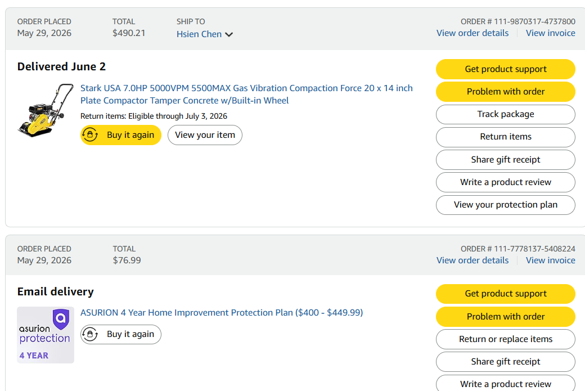
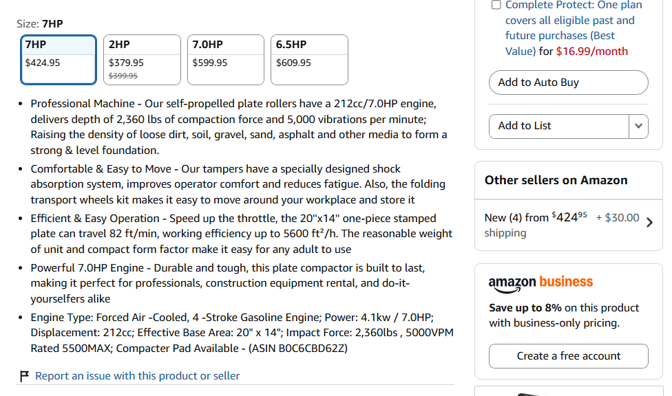
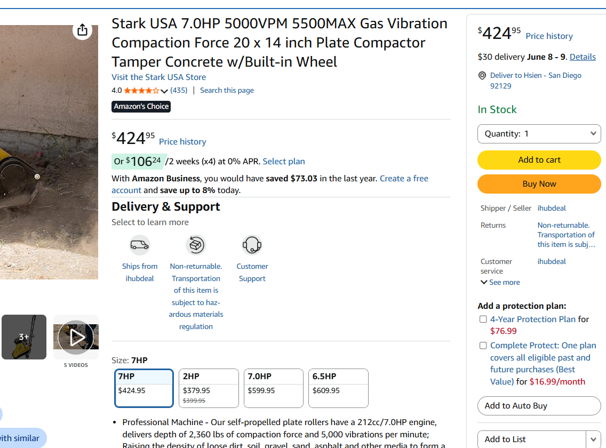
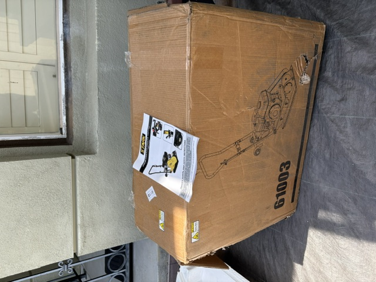
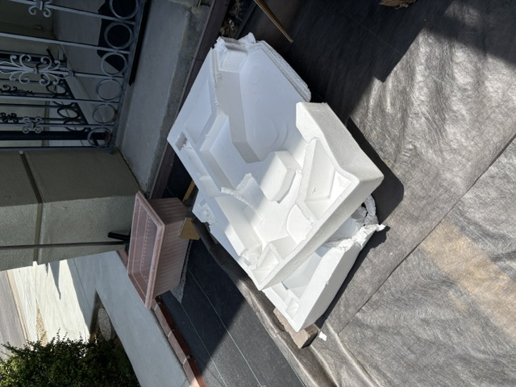
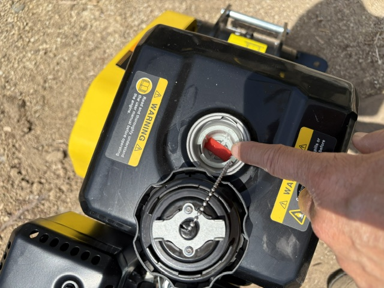
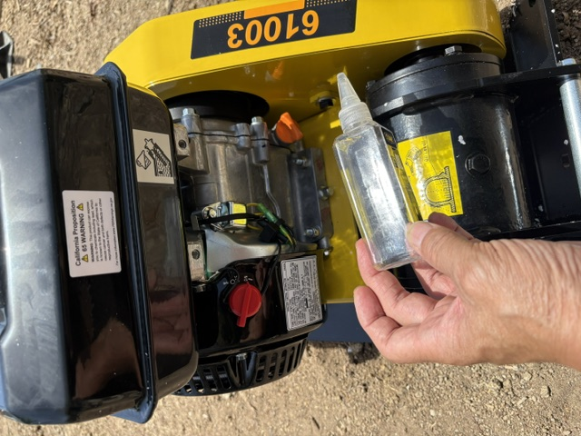
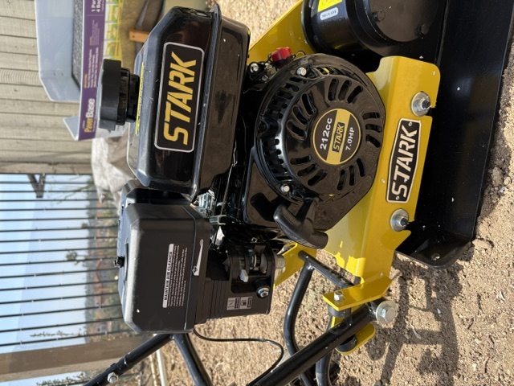
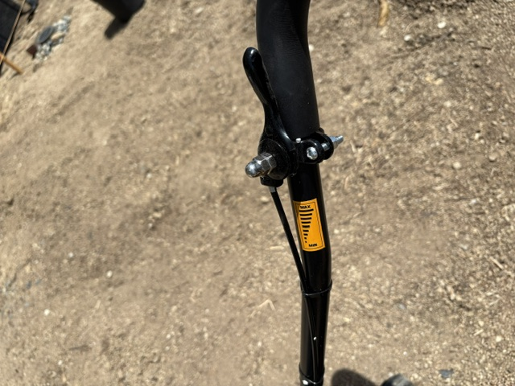

# Refund Request – Stark 61003 Plate Compactor

## Request

I would like to request a return pickup of the item and a full refund of:

1. The Stark 61003 Plate Compactor purchase price
2. The 4-Year Protection Plan purchased with the item

I am not interested in a replacement unit. I would prefer a full refund and pickup from my residence.

## My Purchase
```
Amazon
H Chen
Phone Number: 858-733-1029

4-year Protection Plan

Tracking ID: 381731326579
Order No: 111-9870317-4737800
Payment method: VISA CARD ending in 8741

Delivered June 2

SHIPPING ADDRESS

12427 DARKWOOD RD
SAN DIEGO, CA
```

---

## Product Received

I received the Stark 61003 plate compactor on the evening of delivery.

This morning, I:

- Added approximately one-half gallon of gasoline.
- Filled the engine with the supplied oil.
- Carefully followed the startup instructions provided with the unit.

I then attempted multiple startup procedures and tested various combinations of:

- Choke settings
- Fuel valve positions
- Throttle positions

Despite more than three (3) hours of troubleshooting and repeated attempts, the engine would not start.

---

## Product Concerns

Based on my experience so far, I am not confident in the quality or reliability of the product.

In addition, when I made the purchase, I believed the product was built in the United States. After delivery and inspection of the packaging and labeling, I learned that the unit was manufactured in China, which was not what I expected when placing the order.

For these reasons, I do not wish to receive a replacement unit.

---

## Requested Resolution

Please arrange:

1. Pickup of the item from my residence.
2. A full refund of the original purchase amount.
3. A full refund of the associated 4-Year Protection Plan.
4. Refunds to the original Amazon payment method.

Thank you for your assistance.

Sincerely,

Hsien Tang Chen

---

# Photos and Annotations

### Screen Shots "Stark USA" -
I thought I was buing an US product, there is no reference to Made in China in the description




I would not have placed this order if 
---


### Exterior shipping box received at delivery




I keep the packaging materials.

---

## Have spent 3 hours in attempt

### added 1/2 gallon of gasoline



### added the provided engine oil




### have tried all combination of Choke/Fuel/Throttle





---

## Video

A video demonstrating the startup attempts and engine condition can be provided upon request.